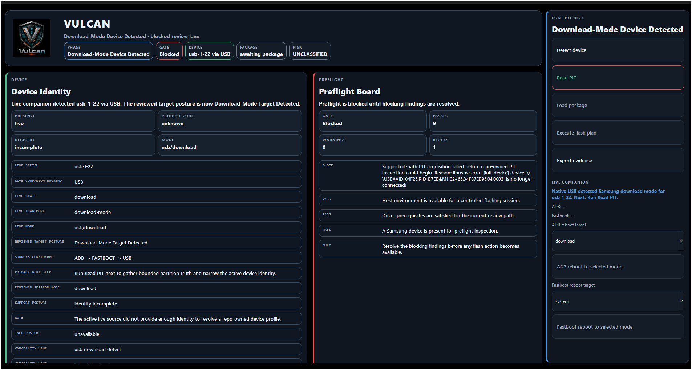
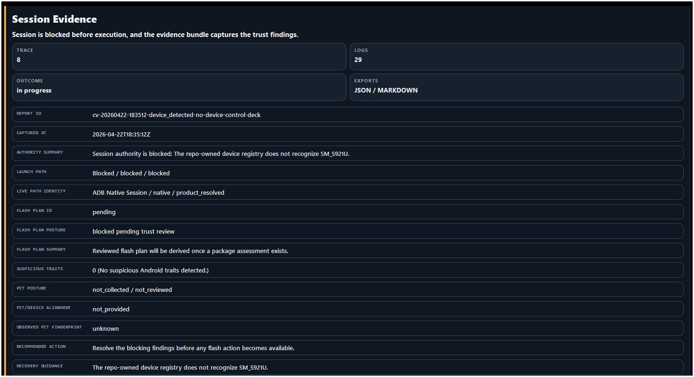

# Project: Calamum Vulcan

**Document ID**: `CALAMUM_VULCAN_README_050`  
**Status**: Public project overview  
**Owner**: ORACL-Prime  
**Project**: Calamum Vulcan  
**Version**: `0.5.0`  
**Last updated**: 2026-04-23

---

  
   
  <em>Samsung-focused open-source Android flashing platform</em>

## Purpose

**Calamum Vulcan** is a Samsung-focused open-source Android flashing platform with GUI-first workflows, preflight validation, and audit-ready evidence.

## Current status

`0.5.0` is now the current **local package-only Sprint 5 boundary** for this repository.

`0.3.0` remains the current **public stable** Calamum Vulcan release on PyPI and as the latest GitHub release object.

Current release posture:

- public GitHub seed: `https://github.com/joediggidyyy/calamum_vulcan`
- release root: this repository root
- validated source-checkout runtime: Python `3.14`
- license: MIT
- current repository package version: `0.5.0`
- current local package boundary: `0.5.0` package-only Sprint 5 boundary (package-ready locally, not published)
- latest sealed repository-visible sprint tag boundary: `v0.4.0` (Sprint 5 repo-visible seal is still a later explicit step)
- latest public stable PyPI/GitHub release: `0.3.0`
- live PyPI project: `https://pypi.org/project/calamum-vulcan/`
- live stable GitHub release: `https://github.com/joediggidyyy/calamum_vulcan/releases/tag/v0.3.0`
- latest sealed repository-visible sprint tag URL: `https://github.com/joediggidyyy/calamum_vulcan/tree/v0.4.0`

## Visual surfaces

These views are presentation surfaces. The underlying evidence and preflight states are the source of truth for the platform.

### Main interface

### Session evidence view

## Source checkout quickstart

From the repository root:

1. activate a validated Python `3.14` environment
2. run the unit suite
3. launch a shell scenario or an integration bundle review

Representative commands:

- `python -m unittest discover -s tests/unit -p "test_*.py"`
- `python calamum_vulcan/launch_shell.py --scenario ready --describe-only`
- `python -m calamum_vulcan.app --integration-suite safe-path-close --suite-format markdown --suite-output temp/fs5_safe_path_close.md`

## Installed-artifact quickstart

For a release-style review from the built wheel:

1. build the artifacts from this repository root
2. install the wheel into a clean Python `3.14` environment
3. verify the public CLI, evidence export, and GUI launch surface

Representative commands:

- `python scripts/build_release_artifacts.py`
- `python -m pip install dist/calamum_vulcan-0.5.0-py3-none-any.whl`
- `calamum-vulcan --scenario ready --describe-only`
- `calamum-vulcan --scenario blocked --describe-only --export-evidence --evidence-format markdown --evidence-output blocked_review.md`
- `calamum-vulcan-gui`

## Packaging and build

Build and inspect release artifacts from the repository root with:

- `python -m pip install -e .[release]`
- `python scripts/build_release_artifacts.py`
- `python scripts/validate_installed_artifact.py`
- `python scripts/run_scripted_simulation_suite.py`

This produces and inspects both `sdist` and `wheel` artifacts from the nested release root.

The installed-artifact runner creates a clean temporary environment, installs the built wheel outside the source tree, verifies the public entry points, exercises evidence export and the sprint-close bundle, and audits the packaged file surface.

Calamum Vulcan now performs one bounded runtime dependency self-heal against the declared `pyproject.toml` dependency set. When the active environment drifts or the installed package metadata goes stale, the runtime refreshes the package from the source checkout when available, or reinstalls the declared runtime requirements in wheel-only contexts.

For the local `0.5.0` package-only boundary, the installed-artifact runner also proves that the packaged wheel preserves the bounded execute lane, the deterministic `safe-path-close` bundle, and the explicit native / delegated / fallback evidence posture.

The scripted simulation runner executes the package-boundary-safe scenario matrix from both the release root and an installed wheel context, checks deterministic JSON and Markdown evidence outputs, validates offscreen GUI launch behavior, and archives the resulting bundle evidence under `temp/fs_p04_scripted_simulation/`.

The empirical review runner performs the clean-install walkthrough, captures packaged GUI screenshots for human review, inspects release-facing evidence exports, and archives the resulting artifacts under `temp/fs_p05_empirical_review/`.

- `python scripts/run_empirical_review_stack.py`

The TestPyPI rehearsal runner performs the final publication gate, attempts the registry rehearsal when credentials are configured, validates registry-delivered install behavior, and records a final go/no-go summary under `temp/fs_p06_testpypi_rehearsal/`.

- `python scripts/run_testpypi_rehearsal.py`

The publication rehearsal accepts TestPyPI credentials from the release-root `.env`, the active shell environment, or the user-level `.pypirc`:

- `CALAMUM_VULCAN_TESTPYPI_TOKEN`
- optional fallback: `TWINE_USERNAME=__token__` and `TWINE_PASSWORD`
- optional shared-user profile: `[testpypi]` in `~/.pypirc`

## Installed entry points

The packaging contract for the local `0.5.0` boundary defines these installed entry points:

- `calamum-vulcan` — console entry point for CLI review flows and GUI launch
- `calamum-vulcan-gui` — console-visible GUI launcher entry point

## Repository layout

| Path                                                          | Purpose                                                  |
| ------------------------------------------------------------- | -------------------------------------------------------- |
| `calamum_vulcan/`                                             | package source, launcher, fixtures, and runtime surfaces |
| `tests/`                                                      | unit and release-lane validation surfaces                |
| `README.md`, `CHANGELOG.md`, `CONTRIBUTING.md`, `SECURITY.md` | tracked public documentation surfaces                    |
| `LICENSE`                                                     | project license                                          |

## Tracked documentation

The tracked documentation surface for this repository stays at the root:

- `README.md` — install, build, support posture, and public usage guidance
- `CHANGELOG.md` — release notes and user-visible change history
- `CONTRIBUTING.md` — contributor workflow and release-lane checks
- `SECURITY.md` — private vulnerability-reporting and disclosure guidance

If you need to report a security issue, use `SECURITY.md` and prefer a private disclosure path over a public issue.

## Scope

Calamum Vulcan is currently focused on Samsung-first flashing workflows with:

- GUI-first operator flows
- package-aware preflight gating
- structured session evidence
- a bounded Heimdall adapter seam for reviewed runtime execution
- repo-owned read-side device detection, info capture, and PIT-aware inspection evidence for the reviewed Samsung subset
- bounded ADB/Fastboot companion controls for detection and reboot handoffs where native ownership is incomplete

## Support posture for the local `0.5.0` package boundary

| Surface                      | `0.5.0` local posture                                                                                                         |
| ---------------------------- | ----------------------------------------------------------------------------------------------------------------------------- |
| Windows packaged build       | empirically reviewed                                                                                                          |
| Linux packaged build         | scripted / installed-artifact validation target only; empirical closeout still pending                                        |
| macOS                        | deferred and outside the intended `0.5.0` package-only boundary                                                               |
| Core flashing workflow       | bounded safe-path lane validated with delegated Heimdall lower transport                                                      |
| Read-side inspection lane    | supported as an evidence-first review workflow for the reviewed Samsung subset                                                |
| Samsung download-mode detect | native USB and delegated-lower-transport evidence both remain explicit, with packaged remediation helpers for supported hosts |
| Selective fallback surface   | explicit where native ADB/PIT/write ownership stops; fallback remains visible rather than implied away                        |
| Publication posture          | package-only boundary; GitHub/PyPI publication remains deferred until the immediate post-`0.6.0` `1.0.0` gate                 |

## Known limitations

| Area                    | Current limitation                                                                                                                       |
| ----------------------- | ---------------------------------------------------------------------------------------------------------------------------------------- |
| Samsung transport core  | the bounded safe-path lane still depends on delegated Heimdall lower transport rather than a fully Calamum-owned integrated runtime      |
| Read-side device matrix | native read-side ownership is still limited to the reviewed Samsung subset; fallback and exhausted states remain explicit                |
| Host matrix             | Windows is the only empirically reviewed packaged host for the local `0.5.0` boundary                                                    |
| Qt deployment           | Qt font packaging still emits a non-blocking warning in some review environments                                                         |
| Fixture debt            | warning-tier checksum placeholder debt remains in legacy fixture manifests, and Heimdall detect fixtures should keep expanding over time |

## Troubleshooting

| Symptom                                       | Likely cause                                                                                    | What to do                                                                                                                                                                              |
| --------------------------------------------- | ----------------------------------------------------------------------------------------------- | --------------------------------------------------------------------------------------------------------------------------------------------------------------------------------------- |
| `calamum-vulcan` will not launch              | wrong interpreter, stale install metadata, or incomplete runtime dependency set                 | use Python `3.14`; Calamum Vulcan will attempt one bounded self-heal, and if the environment still fails, reinstall the package so the full declared runtime dependency set is restored |
| GUI opens without branded assets              | stale wheel built before the branding assets were packaged                                      | rebuild with `python scripts/build_release_artifacts.py` and reinstall the fresh wheel                                                                                                  |
| No device appears in the live companion panel | device is not in the expected mode, ADB is not authorized, or Windows driver state is not ready | re-enter the correct device mode, authorize ADB if applicable, and review the Windows USB/driver posture before retrying                                                                |
| Qt prints a font warning during review        | known packaging debt                                                                            | treat it as a non-blocking warning for now; the shell remains usable while the font-packaging lane is hardened                                                                          |
| Evidence file was not written where expected  | output path or permissions are wrong                                                            | choose a writable output path and rerun the export command                                                                                                                              |

## Release note

`calamum-vulcan==0.5.0` now represents the package-ready local package-only Sprint 5 boundary for this repository. Public promotion remains explicitly deferred to the immediate post-`0.6.0` `1.0.0` promotion gate, `0.3.0` remains the latest stable GitHub/PyPI release, and any repo-visible Sprint 5 seal step remains explicit rather than implied.
